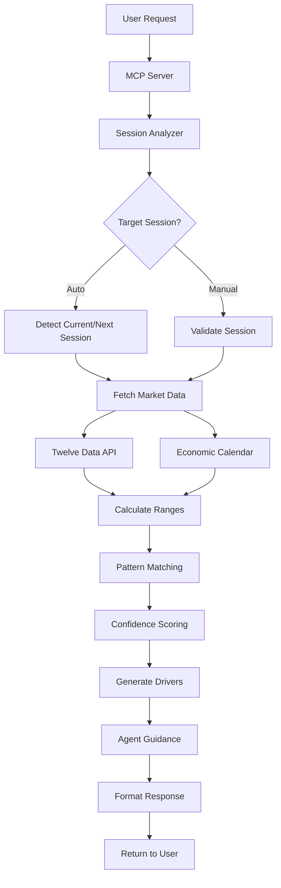

# VOLI-MCP {MCP Server for Forex Session Volatility Analysis}
A sophisticated MCP (Model Context Protocol) server that provides real-time forex session volatility analysis and trading guidance. Leverages historical pattern matching, market data, and economic calendar integration to deliver actionable insights for forex traders. 

<p align="center">
  
[](https://www.python.org/downloads/)
[](LICENSE)
[](https://modelcontextprotocol.io/)

</p>

## CRACKED DEVS BEHIND THIS

<p align="center">
  
  
</p>

##  Table of Contents

- [Overview](#overview)
- [Key Features](#key-features)
- [Architecture](#architecture)
- [Installation](#installation)
- [Configuration](#configuration)
- [Usage](#usage)
- [API Reference](#api-reference)
- [Project Structure](#project-structure)
- [Data Flow](#data-flow)
- [Testing](#testing)
- [Contributing](#contributing)
- [License](#license)

##  Overview

VOLI-MCP (Volatility Analysis for Forex Sessions) is an MCP server designed to analyze forex market volatility during different trading sessions (Asian, London, New York). It combines:

- **Real-time market data** from Twelve Data API
- **Economic calendar integration** for event awareness
- **Historical pattern matching** using 30-60 days of data
- **Advanced volatility calculations** including range analysis and compression detection
- **Confidence scoring** based on historical accuracy
- **Agent-specific trading guidance** tailored to different trading styles

The server exposes a single MCP tool `analyze_forex_session` that accepts a currency pair and target session, returning comprehensive analysis including expected deviation, confidence levels, market drivers, and trading recommendations.

##  Key Features

###  Comprehensive Analysis
- **Session Detection**: Automatic detection of current/next trading sessions
- **Volatility Forecasting**: Expected deviation in pips for upcoming sessions
- **Pattern Recognition**: Historical pattern matching with similarity thresholds
- **Compression Analysis**: Detection of pre-session range compression indicating potential breakout

###  Data Integration
- **Market Data**: Real-time and historical forex data via Twelve Data API
- **Economic Calendar**: Integration with economic event data for enhanced analysis
- **Multiple Timeframes**: Support for intraday (5-min) and daily data analysis

###  Intelligent Guidance
- **Confidence Scoring**: Statistical confidence based on historical accuracy
- **Market Drivers**: Clear explanations of factors influencing volatility
- **Agent Guidance**: Tailored recommendations for different trading approaches
- **Volatility Classification**: Categorized volatility levels (Low/Medium/High)

###  Developer-Friendly
- **MCP Protocol**: Standards-compliant MCP server using stdio transport
- **HTTP API Wrapper**: FastAPI-based REST API for testing and integration
- **Comprehensive Testing**: Full test suite with mock data support
- **Modular Architecture**: Clean separation of concerns for easy maintenance

##  Architecture

VOLI follows a modular architecture with clear separation of responsibilities:

```
┌─────────────────┐    ┌──────────────────┐    ┌─────────────────┐
│   MCP Server    │────│  SessionAnalyzer │────│   Data Layer    │
│   (server.py)   │    │                  │    │                 │
└─────────────────┘    └──────────────────┘    └─────────────────┘
                                │                       │
                                ▼                       ▼
                       ┌──────────────────┐    ┌─────────────────┐
                       │  Analysis Layer  │    │  External APIs  │
                       │                  │    │                 │
                       └──────────────────┘    └─────────────────┘
```

### Core Components

- **MCP Server**: Handles MCP protocol communication and tool exposure
- **Session Analyzer**: Main orchestration logic for analysis workflow
- **Data Layer**: Clients for Twelve Data API and economic calendar
- **Analysis Layer**: Range calculation, pattern matching, confidence scoring
- **Utilities**: Session management, data formatting, validation

##  Installation

### Prerequisites

- Python 3.10 or higher
- Valid Twelve Data API key (free tier available)
- Internet connection for API access

### Step 1: Clone the Repository

```bash
git clone https://github.com/Ash-Cyber-and-Computer-Organization/Voli-MCP.git
cd Voli-MCP
```

### Step 2: Create Virtual Environment

```bash
# Create virtual environment
python -m venv .venv

# Activate it
source .venv/bin/activate  # Linux/Mac
# OR
.venv\Scripts\activate     # Windows
```

### Step 3: Install Dependencies

```bash
# Install from pyproject.toml
pip install -e .

# OR install from requirements.txt
pip install -r requirements.txt
```

### Step 4: Verify Installation

```bash
# Check installed packages
pip list

# Run basic import test
python -c "from src.tools.session_analyzer import analyze_forex_session; print('Installation successful')"
```

## Configuration

### Environment Variables

Create a `.env` file in the project root:

```bash
# Copy example file
cp .env.example .env

# Edit with your API key
TWELVE_DATA_API_KEY=your_actual_api_key_here
MAX_REQUESTS_PER_DAY=800
REQUEST_DELAY_SECONDS=1
LOG_LEVEL=INFO
```

### API Key Setup

1. Visit [Twelve Data](https://twelvedata.com/) and sign up for a free account
2. Get your API key from the dashboard
3. Add it to your `.env` file

### Rate Limiting

The server includes built-in rate limiting:
- **Free Tier**: 800 requests/day
- **Configurable Delay**: 1 second between requests (configurable)
- **Automatic Backoff**: Exponential backoff on rate limit errors

## Usage

### MCP Server (Production)

Run the MCP server for integration with MCP-compatible clients:

```bash
# Start the MCP server
python -m src.server
```

### Integration with Claude Desktop

Add to your `claude_desktop_config.json`:

```json
{
  "mcpServers": {
    "voli-forex": {
      "command": "python",
      "args": ["-m", "src.server"],
      "cwd": "/path/to/voli-mcp",
      "env": {
        "TWELVE_DATA_API_KEY": "your_api_key_here"
      }
    }
  }
}
```

### HTTP API Wrapper (Testing)

For testing and development, use the FastAPI wrapper:

```bash
# Start HTTP server
python api_wrapper.py

# Server runs on http://localhost:8000
# Interactive docs at http://localhost:8000/docs
```

### MCP Inspector (Development)

Use MCP Inspector for visual testing:

```bash
# Install inspector
npm install -g @modelcontextprotocol/inspector

# Run with inspector
npx @modelcontextprotocol/inspector python -m src.server
```

Opens web UI at `http://localhost:5173` for interactive testing.

## API Reference

### MCP Tool: `analyze_forex_session`

Analyzes forex session volatility and generates trading guidance.

#### Parameters

| Parameter | Type | Required | Description |
|-----------|------|----------|-------------|
| `pair` | string | Yes | Currency pair (e.g., "EUR/USD", "GBP/JPY") |
| `target_session` | string | No | Session: "asian", "london", "ny", or "auto" (default: "auto") |

#### Supported Pairs

- Majors: EUR/USD, GBP/USD, USD/JPY, USD/CHF, AUD/USD, USD/CAD, NZD/USD
- Minors: EUR/GBP, EUR/JPY, GBP/JPY, etc.
- Select Exotics: EUR/TRY, USD/TRY, etc.

#### Response Schema

```json
{
  "pair": "EUR/USD",
  "session": "London Session",
  "time_window_minutes": 90,
  "volatility_expectation": "Medium",
  "expected_deviation_pips": 45.2,
  "confidence": 0.78,
  "drivers": [
    "Pre-session range compressed (18.7 pips vs 30-day avg of 26.4 pips)",
    "No major economic events in next 2 hours",
    "Historical data shows mixed outcomes for similar conditions (23 comparable days)"
  ],
  "historical_context": {
    "similar_conditions_occurrences": 23,
    "expansion_rate": 0.52
  },
  "agent_guidance": "Monitor for breakout above/below pre-session high/low. Consider reducing position sizes due to moderate confidence."
}
```

#### Example Usage

```python
from src.tools.session_analyzer import analyze_forex_session

# Analyze EUR/USD for next session
result = analyze_forex_session("EUR/USD", "auto")
print(result)
```

### HTTP API Endpoints

When running the API wrapper:

- `GET /` - API information and available endpoints
- `GET /docs` - Interactive Swagger documentation
- `GET /health` - Health check
- `POST /analyze` - Analyze session (same as MCP tool)

##  Project Structure

```
voli-mcp/
├── .env                    # Environment variables (API keys)
├── .env.example           # Environment template
├── .gitignore            # Git ignore rules
├── .python-version       # Python version specification
├── README.md             # This file
├── pyproject.toml        # Project configuration
├── requirements.txt      # Dependencies
├── api_wrapper.py        # FastAPI HTTP wrapper for testing
├── PULL_REQUEST.md       # Pull request template
├── docs/                 # Documentation
│   ├── huh.md           # Additional docs
│   └── readme/
│       └── eng.md       # Detailed developer guide
├── src/                  # Source code
│   ├── __init__.py
│   ├── server.py         # MCP server implementation
│   ├── analysis/         # Analysis modules
│   │   ├── __init__.py
│   │   ├── confidence_scorer.py
│   │   ├── pattern_matcher.py
│   │   └── range_calculator.py
│   ├── data/             # Data clients
│   │   ├── __init__.py
│   │   ├── calendar_client.py
│   │   └── twelve_data_client.py
│   ├── tools/            # MCP tools
│   │   ├── __init__.py
│   │   └── session_analyzer.py
│   └── utils/            # Utilities
│       ├── __init__.py
│       ├── formatters.py
│       └── sessions.py
└── tests/                # Test suite
    ├── __init__.py
    ├── test_analysis.py
    ├── test_data_clients.py
    ├── test_full_system.py
    └── test_utils.py
```

##  Data Flow



### Detailed Flow Steps

1. **Input Validation**: Validate currency pair and session parameters
2. **Session Detection**: Determine target session (auto-detect if needed)
3. **Data Fetching**: Retrieve intraday and historical market data
4. **Range Analysis**: Calculate pre-session and historical ranges
5. **Compression Detection**: Identify if current range is compressed vs. average
6. **Pattern Matching**: Find similar historical conditions
7. **Event Checking**: Query economic calendar for upcoming events
8. **Deviation Calculation**: Estimate expected session volatility
9. **Confidence Scoring**: Calculate statistical confidence
10. **Driver Generation**: Explain factors influencing analysis
11. **Guidance Creation**: Generate trading recommendations
12. **Response Formatting**: Structure output according to schema

##  Testing

VOLI includes a comprehensive test suite covering all components:

### Running Tests

```bash
# Run all tests
python -m pytest tests/

# Run specific test modules
python tests/test_utils.py
python tests/test_data_clients.py
python tests/test_analysis.py
python tests/test_full_system.py

# Run with coverage
python -m pytest tests/ --cov=src --cov-report=html
```

### Test Categories

- **Unit Tests**: Individual component testing
- **Integration Tests**: Full system workflow testing
- **API Tests**: Data client reliability testing
- **Mock Tests**: Tests without external API dependencies

### Test Data

Tests use a combination of:
- Real API data (requires valid API key)
- Mock data for offline testing
- Historical test scenarios

##  Contributing

We welcome contributions! Please follow these steps:

### Development Setup

1. Fork the repository
2. Create a feature branch: `git checkout -b feature/your-feature`
3. Set up development environment (see Installation)
4. Make your changes
5. Run tests: `python -m pytest tests/`
6. Commit changes: `git commit -am 'Add your feature'`
7. Push to branch: `git push origin feature/your-feature`
8. Create Pull Request

### Code Standards

- Follow PEP 8 style guidelines
- Add type hints for function parameters and return values
- Write comprehensive docstrings
- Add unit tests for new functionality
- Update documentation as needed

### Pull Request Process

1. Update the `PULL_REQUEST.md` template with your changes
2. Ensure all tests pass
3. Update README.md if adding new features
4. Request review from maintainers

##  License

This project is licensed under the MIT License - see the [LICENSE](LICENSE) file for details.

##  Acknowledgments

- [Twelve Data](https://twelvedata.com/) for market data API
- [Model Context Protocol](https://modelcontextprotocol.io/) for the protocol specification
- [Anthropic](https://www.anthropic.com/) for Claude Desktop integration

##  Support

- **Issues**: [GitHub Issues](https://github.com/Ash-Cyber-and-Computer-Organization/Voli-MCP/issues)
<!--- **Discussions**: [GitHub Discussions](https://github.com/your-username/voli-mcp/discussions) -->
- **Documentation**: See `docs/` directory for detailed guides

---

**Happy Trading! **
